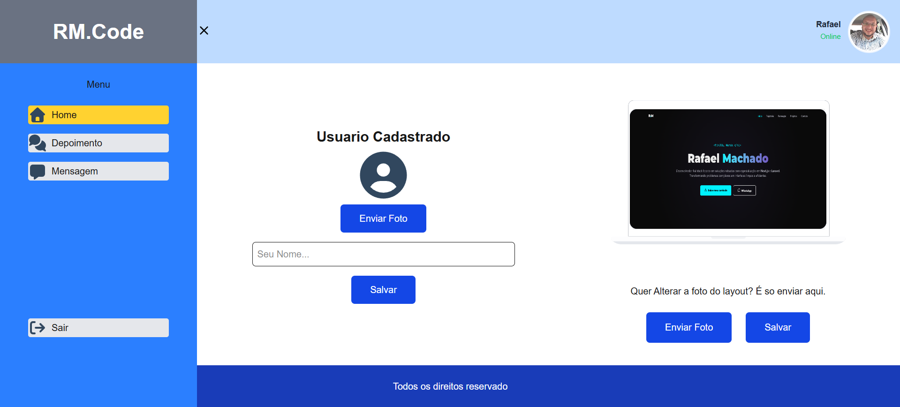

# 🚀 Agência Bold - Full Stack Project

> Uma landing page institucional de alta conversão para a Agência Bold. O projeto possui um ecossistema completo com front-end desacoplado na Vercel e uma API em produção rodando em uma infraestrutura VPS dedicada. Inclui um painel administrativo customizável para gerenciar layouts, depoimentos e leads.

---

## 📷 Demonstração & Acesso ao Painel 

* **Link da Landing Page:** [Visite o site](https://vercel.app)

* **Painel Administrativo:** Acesse `/admin` após a URL do site (ex: `https://vercel.app/admin`).

### 🔐 Dados de Acesso para Teste (Admin):
* **E-mail:** `admin@admin.com`
* **Senha:** `123456`

---

## 🏗️ Arquitetura do Projeto

O projeto foi desenvolvido seguindo o modelo de arquitetura desacoplada (API-driven):

* **`/frontend`**: Aplicação SPA desenvolvida com Next.js, React e TypeScript, hospedada globalmente na **Vercel**.
* **`/backend`**: API RESTful desenvolvida em Laravel, hospedada em uma infraestrutura em nuvem **VPS (Oracle Cloud)**.

---

## 🛠️ Stack Tecnológica

* **Front-end:** Next.js (App Router), TypeScript, Tailwind CSS, JS-Cookie.
* **Back-end:** PHP, Framework Laravel.
* **Banco de Dados:** MySQL.
* **Infraestrutura:** Oracle Cloud VPS, Ubuntu Server, Apache, DuckDNS (SSL Let's Encrypt).

---

## 🧑‍💻 Autor

* **Rafael Machado** - [LinkedIn](https://linkedin.com) - [E-mail](mailto:rafael_machado032@yahoo.com.br)
