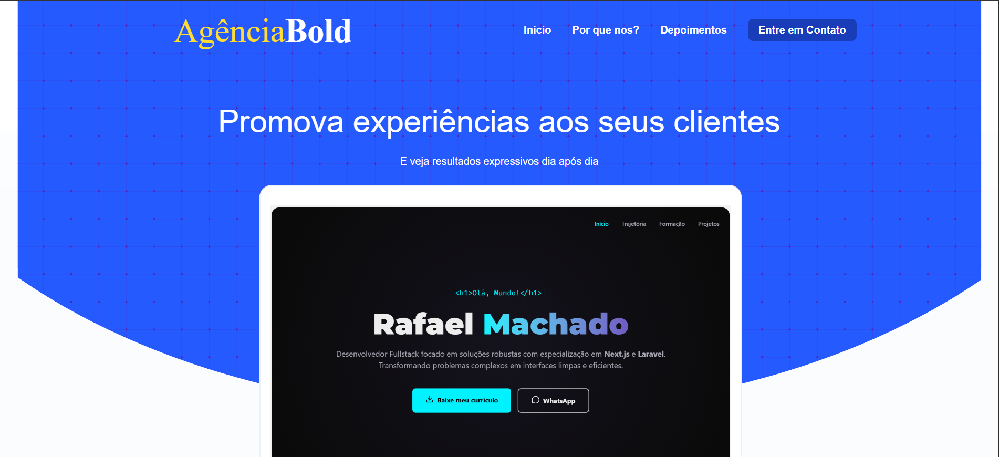

# 🚀 Agencia Bold

> Desenvolvido com Next.js, React e Tailwind CSS para centralizar minhas criações e evolução técnica. Totalmente responsivo, otimizado para performance e integrado aos meus repositórios de código. Através dele, você tem acesso direto aos meus projetos em Laravel, Next.js e ao meu GitHub

---

## 📷 Demonstração


*Link do projeto:* [Visite o site](https://agenciabold1.vercel.app)

---

## 🛠️ Tecnologias Utilizadas

### Front-end
* **Next.js** — Framework React para produção.
* **TypeScript** — Tipagem estática para maior segurança no código.
* **Tailwind CSS** — Estilização rápida e responsiva baseada em classes utilitárias.

---

## ✨ Funcionalidades Principais

* 🔐 Autenticação segura de usuários no painel admin.
* 📱 Design totalmente responsivo (mobile-first).
* 🔄 Consumo de API RESTful em tempo real.
* ⚙️ Conteudo dinâmico para cada função
---

## 🚀 Como Executar o Projeto

### Pré-requisitos
Você precisará ter instalado: Git, Node.js, PHP e Composer.

### 1. Clonar o repositório
```bash
git clone https://github.com/Rafael-Machado032/Back-End-Estudos.git
cd Portifolio
```

### 3. Configurar o Front-end (Next.js)
Abra um novo terminal na raiz do projeto:
```bash
cd frontend
npm install
npm run dev
```

## Leitura de cookies pelo lado do cliente teste

1. Instalação do pacote
```bash
    npm install js-cookie
    npm install --save-dev @types/js-cookie
```
2. importe a biblioteca
```jsx
    import Cookies from 'js-cookie';
```
Para leitura use o comando
```jsx
    const cookieVariavel = Cookies.get('campoDoCookie');
```